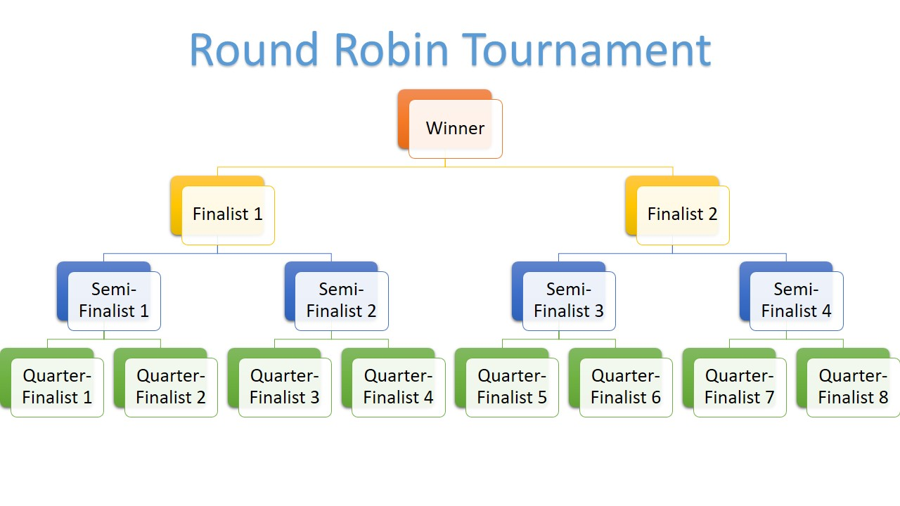

I watched the first couple of [YouTube videos by Tim Corey](https://www.youtube.com/watch?v=HalXZUHfKLA&list=PLLWMQd6PeGY3t63w-8MMIjIyYS7MsFcCi) where he creates a tournament tracker desktop application from start to finish. I just finished the first features of the [PriceBook desktop application](https://www.jaderickerts.com/projects/pricebook.html) and wanted to try something different to just take my mind off that project for a while.

<!-- end -->

As I started the series, Tim talks about the round robin format in tournaments and asked how one would handle a tournament that doesn't have 2, 4, 8, 16, 32 etc. players (powers of 2)? This got me thinking so I tried out my theory in a console application quick fast.

The round robin format is where two teams or players play against each other. The winner of that match moves onto the next round until the last team or player remains. That is how you end up with powers of 2 because each round has a number of teams or players equal to a power of 2, depending on which round the tournament is in. 



First things first, you need to have a bye round. A bye round would be round where some players play the round while others sit out. The goal of the bye round is to get the amount of players in the tournament down to a power of 2. Then all the remaining players can play against each other i.e. all players play in that round.

## How do you determine how many players play in the bye round? 
When I thought about this problem, I first that I should determine the minimum amount of players that should play and work my way up from there. I would start at 2 players, half it and add the remaining players who didn't play and compare that amount a power of 2.
There are only a couple of powers of 2, so I didn't care about that at first, I could just make that calculation in my head. So my initial algorithm was something like this:
```csharp
for(int i = 0; i < amountOfPlayers; i++){
    int notPlaying = amountOfPlayers - (i * 2);
    if(powerOfTwo == (notPlaying + i)){
        return notPlaying;
    }
}
```

That seemed like a long way round. I thought wouldn't it be easier to first find out how many players need to eliminated from the tournament first before we can "officially" start the tournament with an amount of players that equal to a power of two. Therefore, if I need to eliminate 5 to get to a round of 8 for example (that means there are 13 players in the tournament), I double 5 which equals to the amount of players that have to play and then deduct that from total amount of players in the tournament to determine the amount of players that don't have to play the bye round. It totally makes sense. This is the calculate the amount of players to play the bye round function:
```csharp
int result = (amountOfPlayersInTournament - CalculateStartingTournamentRound(amountOfPlayersInTournament))*2;
return result;
```

The next step now was to figure out how to determine what's the first "official" round (the first round after the bye round is completed). That's easy. The highest power of two that isn't more than the amount of players in the tournament. 
```csharp
int result = 0;			
for(int i = 1; i <= amountOfPlayers; i=i*2){
    result = i;
}
return result; 
```